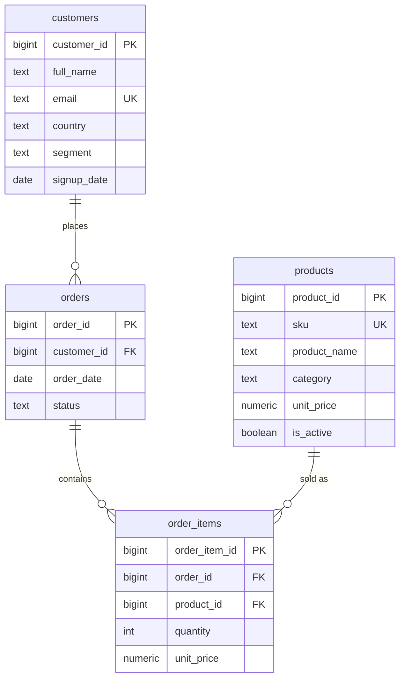

# retail-analytics-sql

A PostgreSQL retail-analytics database — schema, deterministic seed data, analytical views, and window-function queries (revenue growth, RFM, top-N), all verified in CI against Postgres 16.


## ER overview



Everything is created inside a dedicated `retail` schema. `order_items.unit_price` snapshots the price at sale time, and `orders.status` drives what counts as revenue — only `completed` orders are monetized.

## Load it locally

Requires a running PostgreSQL 16 instance and `psql`.

```bash
createdb retail_analytics

psql -d retail_analytics -v ON_ERROR_STOP=1 -f schema.sql
psql -d retail_analytics -v ON_ERROR_STOP=1 -f seed.sql
psql -d retail_analytics -v ON_ERROR_STOP=1 -f views.sql

# run the analytical queries
for f in queries/*.sql; do psql -d retail_analytics -v ON_ERROR_STOP=1 -f "$f"; done

# run the assertion suite
psql -d retail_analytics -v ON_ERROR_STOP=1 -f tests/run.sql
```

Scripts are idempotent at the top level: `schema.sql` drops and recreates the `retail` schema, so you can re-run the whole pipeline from scratch.

## Analytical highlights

| File | What it computes | SQL techniques shown |
|------|------------------|----------------------|
| `views.sql` → `monthly_revenue` | Revenue, order count, AOV per month | `date_trunc`, conditional aggregation |
| `views.sql` → `top_customers` | Lifetime spend ranking | `RANK()` window, `LEFT JOIN` to keep non-buyers |
| `views.sql` → `product_performance` | Units, revenue, and each product's share of its category | `SUM(SUM(...)) OVER (PARTITION BY category)` |
| `views.sql` → `customer_rfm` | Recency / Frequency / Monetary scoring + labels | CTE pipeline, `NTILE(4)` quartiles, `CASE` segmentation |
| `queries/01_month_over_month_growth.sql` | MoM revenue growth % | `LAG()` to reach the prior month |
| `queries/02_top_n_products_per_category.sql` | Top 2 products per category | `ROW_NUMBER()` partitioned, filter ranked set |
| `queries/03_repeat_purchase_rate.sql` | % of customers who ordered more than once | `COUNT(*) FILTER (WHERE ...)` |
| `queries/04_aov_by_segment.sql` | AOV per segment vs. overall mean | group aggregate + `AVG() OVER ()` global window |
| `queries/05_rfm_segment_summary.sql` | Customers & revenue per RFM label | builds on the RFM view, `SUM() OVER ()` for share |

The seed spans Jan–Jun 2025 across 5 product categories with a deliberate mix of `completed`, `cancelled`, `returned`, and `pending` orders so the "revenue = completed only" rule is actually exercised.

## CI

`.github/workflows/ci.yml` spins up a `postgres:16` service container on every push and pull request to `main`, waits for readiness, then runs `schema.sql`, `seed.sql`, `views.sql`, every file in `queries/`, and `tests/run.sql` through `psql -v ON_ERROR_STOP=1`. Any SQL error — or any failed assertion in `tests/run.sql` — fails the build.

## Tech

- PostgreSQL 16
- Window functions (`LAG`, `ROW_NUMBER`, `RANK`, `NTILE`, windowed aggregates)
- CTEs and views for layered, reusable analytics
- `DO $$ ... $$` / `ASSERT` for data-quality tests
- GitHub Actions with a service container for end-to-end SQL CI
