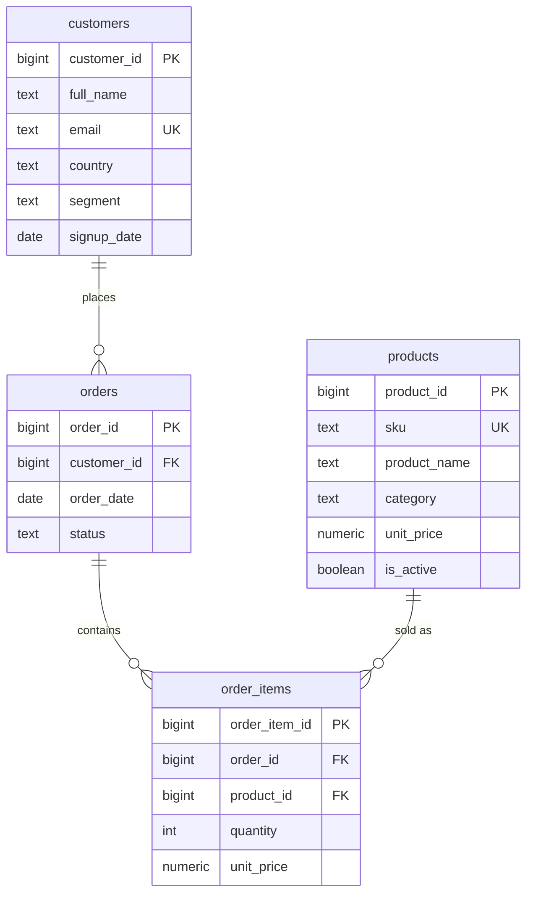

# retail-analytics-sql

A small PostgreSQL retail database: schema, a deterministic seed, a few analytical views, and some window-function queries (revenue growth, RFM, top-N). CI runs the whole thing against Postgres 16 on every push.


## ER overview



Everything lives in a `retail` schema. `order_items.unit_price` is the price at the time of sale, and only `completed` orders count as revenue — `orders.status` decides that.

## Load it locally

You need PostgreSQL 16 running and `psql`.

```bash
createdb retail_analytics

psql -d retail_analytics -v ON_ERROR_STOP=1 -f schema.sql
psql -d retail_analytics -v ON_ERROR_STOP=1 -f seed.sql
psql -d retail_analytics -v ON_ERROR_STOP=1 -f views.sql

# analytical queries
for f in queries/*.sql; do psql -d retail_analytics -v ON_ERROR_STOP=1 -f "$f"; done

# assertion suite
psql -d retail_analytics -v ON_ERROR_STOP=1 -f tests/run.sql
```

`schema.sql` drops and recreates the `retail` schema, so you can re-run the whole pipeline from scratch.

## What's in it

The views in `views.sql` cover monthly revenue (with AOV), a lifetime-spend customer ranking, per-product share of its category, and an RFM scoring view built from an `NTILE(4)` CTE pipeline. The files under `queries/` show month-over-month growth with `LAG()`, top-2 products per category with `ROW_NUMBER()`, repeat-purchase rate with `FILTER`, AOV per segment against a global `AVG() OVER ()`, and an RFM segment summary.

The seed spans Jan–Jun 2025 over 5 categories with a deliberate mix of `completed`, `cancelled`, `returned`, and `pending` orders so the "revenue = completed only" rule actually gets exercised.

## CI

`.github/workflows/ci.yml` spins up a `postgres:16` service container, then runs `schema.sql`, `seed.sql`, `views.sql`, every file in `queries/`, and `tests/run.sql` with `ON_ERROR_STOP=1`. Any SQL error or failed assertion fails the build.

## Notes

I kept the seed deterministic on purpose — the assertions in `tests/run.sql` check exact numbers, and that only works if the data is fixed. So the queries get verified end to end, not just parsed.

The catch is the dataset is tiny, so the RFM quartile labels come out a bit lopsided — `NTILE(4)` over a handful of customers doesn't give clean buckets. It's really meant to show the SQL on a schema you can read in one sitting, not to be a realistic data volume. Swapping in a larger generated seed is the obvious next step.

## License

MIT — see [LICENSE](LICENSE).
